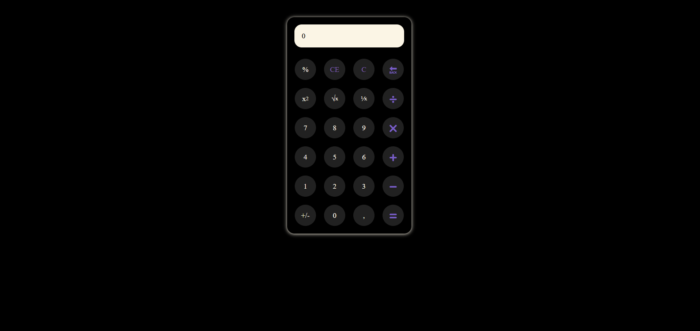

# jQuery
 <h1>To-Do List Application</h1>
    
    <h2>Overview</h2>
    

        This is a simple To-Do List application built using HTML, CSS, and jQuery. It allows users to add, check off, and delete tasks easily.
    

    <h2>Features</h2>
    <ul>
        <li>Add new tasks by typing in the input field and pressing <code>Enter</code>.</li>
        <li>Check off tasks by clicking the check icon.</li>
        <li>Delete tasks by clicking the trash icon.</li>
        <li>Tasks can be rearranged by dragging and dropping.</li>
        <li>Responsive design that adapts to various screen sizes.</li>
    </ul>
    <h2>Technologies Used</h2>
    <ul>
        <li>HTML5</li>
        <li>CSS3</li>
        <li>jQuery</li>
        <li>jQuery UI</li>
    </ul>
<h1>Calculator jQuery - README</h1>

<h2>Overview</h2>

This project is a simple calculator built using HTML, CSS, and jQuery. It allows users to perform basic arithmetic operations, including addition, subtraction, multiplication, and division, as well as advanced operations like squaring, square roots, and percentages.

<h2>Features</h2>
<ul>
    <li><strong>Basic Operations</strong>: Perform addition, subtraction, multiplication, and division.</li>
    <li><strong>Advanced Operations</strong>: Calculate square and square root.</li>
    <li><strong>Percentage Calculation</strong>: Easily calculate percentages.</li>
    <li><strong>Clear and Backspace Functions</strong>: Clear the input or remove the last digit.</li>
    <li><strong>Responsive Design</strong>: The calculator is designed to be user-friendly and visually appealing.</li>
</ul>
<h2>Technologies Used</h2>
<ul>
    <li><strong>HTML</strong>: Structure of the calculator.</li>
    <li><strong>CSS</strong>: Styling and layout.</li>
    <li><strong>jQuery</strong>: Interactivity and functionality.</li>
</ul>
<h3>File Structure</h3>
<pre><code>calculator-jquery/
├── index.html         # Main HTML file
├── assets/
│   ├── style.css      # CSS styles for the calculator
│   └── script.js      # jQuery functionality</code></pre>

<h2>Usage</h2>
<ol>
    <li>Click on the number buttons to enter numbers.</li>
    <li>Click on the operation buttons to perform calculations.</li>
    <li>Use the <code>C</code> button to clear the input or <code>CE</code> to reset the current input.</li>
    <li>Use the <code>🔙</code> button to delete the last digit.</li>
    <li>The result will be displayed on the screen.</li>
</ol>
<h2>Code Explanation</h2>
<ul>
    <li><strong>HTML Structure</strong>: The HTML file contains a <code>div</code> for the calculator, a screen to display results, and buttons for user interaction.</li>
    <li><strong>CSS Styles</strong>: The CSS file styles the calculator layout, buttons, and screen for a better user experience.</li>
    <li><strong>jQuery Functionality</strong>: The jQuery script handles button clicks, performs calculations, and updates the display.</li>
</ul>
<h2>Acknowledgments</h2>

Thanks to the open-source community for providing resources and tools that make projects like this possible.

<h2>Contact</h2>

For any inquiries or feedback, feel free to reach out to me at <a href="https://www.linkedin.com/in/ana-burcovschi-2a0b8b271/">LinkedIn</a>.

